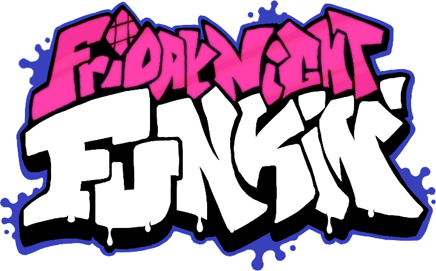

# Friday Night Funkin': Ominous Engine

### If you want to contribute Ominous Engine read [this](https://github.com/MasterOminousDev/Ominous-Engine/CONTRIBUTING.md) first
### If you want to build Ominous Engine read [this](https://github.com/MasterOminousDev/Ominous-Engine/docs/building.md) first

This is the repository for Friday Night Funkin': Ominous Engine, a reworked engine for the game originally made for Ludum Dare 47 "Stuck In a Loop".

Play the Ludum Dare prototype here: https://ninja-muffin24.itch.io/friday-night-funkin
Play the Newgrounds one here: https://www.newgrounds.com/portal/view/770371
Support the project on the itch.io page: https://ninja-muffin24.itch.io/funkin

## Credits

- [ninjamuffin99](https://twitter.com/ninja_muffin99) - Programmer of Friday Night Funkin'
- [PhantomArcade3K](https://twitter.com/phantomarcade3k) and [Evilsk8r](https://twitter.com/evilsk8r) - Art of Friday Night Funkin'
- [Kawaisprite](https://twitter.com/kawaisprite) - Musician of Friday Night Funkin'
- [MasterOminousDev (the idiot that made the engine)](https://github.com/MasterOminousDev) - Everything on the engine

## Shoutouts
- [Kade](https://github.com/KadeDev) and [Eric](https://github.com/MasterEric) - Code (that i borrowed for the first release!)
- [Puyo](https://github.com/puyoxyz) - Code (that i used for the website)

Thanks for taking a look at my young engine lol!

ggggggggggggggggggggggggggggggggggggggggggggggggggggggggggggggggggggggggg-

get ready for the first release of the engine!!
